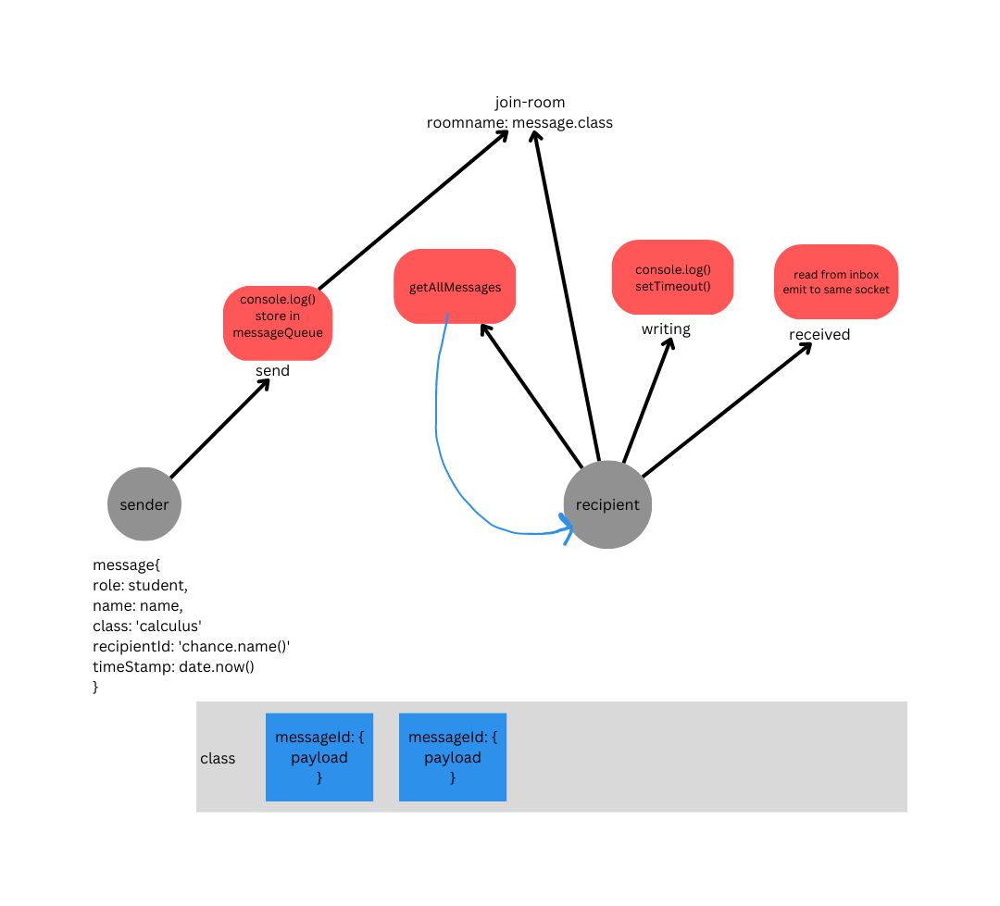

## Project: Message-App

### Members: Miranda Lu, Michael Dulin, Zachariah Jeter

### Problem Domain
For our Group Project, We decided to build a messaging app for "students" that would allow you to send and leave messages to "instructors". The "room" in this app is their class (such as Biology, English, etc.), and the instructor can access their messages by the class and student name.

The only person actively listening is the student, the instructor never listens on the port so they only have access to the queue.

### Links and Resources

- [GitHub Actions ci/cd]()

### Setup

1. Install dependencies: npm -i
2. Start the server: node server/hub.js
3. Start the sender: node client/sender.js
4. Start the receiver: node client/recipient.js

#### `.env` requirements (where applicable)

- set up PORT if you wish, otherwise it will be on 3001

#### Installed Dependencies 

- chance
- socket.io
- socket.io -cli
- jest

Note: If you start the recipient first, the recipient will not hear messages curretly incoming, only what was left in the mailbox 
(feature incoming for currently listening)

## Yet another UML...

**UML V1**

**UML V2**

